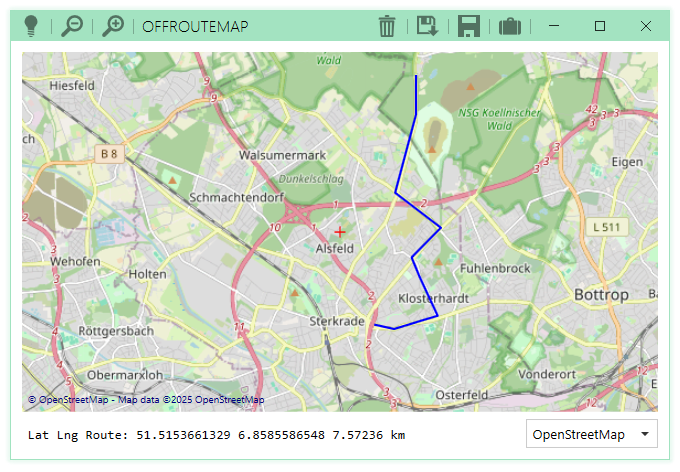

# OffRouteMap

A simple but modern Windows Application in C# and WPF to get and cache free
map tiles (e.g. OSM or OpenBusMap) and use them offline to draw and measure routes
in kilometers, save and load them.

## Creation roadmap and ideas

- make this readme in inital comit and make everything public on github (good idea?!)
- cool and easy gui size and dark/light modes via MahApps.Metro
- store gui size and dark mode in setting
- store last map position in settings
- does a nuget osm package still exist with needful features?
- design a single window application
- hide issues, if map title not downloadable (offline mode)
- cache map tiles in same way like foxtrotgps in a folder
- multithread downloads (?)
  - use a producer/consumer pattern 
  - maybe using LiveCharts2 to visualisze downloads
- maybe allow to set different map tile url sources similar to foxtrotgps
  - code must be open for that feature
  - see https://github.com/ArduPilot/MissionPlanner/blob/master/ExtLibs/Maps/WMSProvider.cs
- in code docu 

## Features

- map
  - [x] given area from window size / region
  - [x] load tiles from given folder
  - [x] load tiles from network if missing 
  - [x] select different maps
  - [ ] add and customize differnt mapProvider urls (optional)
  - [x] move area via right click
  - [x] in/out zoom via mouse wheel
  - [x] display position of map center in status line
- route
  - [x] display on map in all zoom states
  - [x] start, end and set a point via double click
  - [x] remove route from map (trash icon)
  - [x] display distance in status line
- settings
  - [x] tiles folder
  - [x] GUI size and dark mode
  - [x] initial/last position
  - [x] initial/last zoom
- menu (or similar)
  - [ ] load route (file window)
  - [ ] save route (file window)
  - [x] set tiles folder ("file" window, suitcase icon)

## Future tasks

- [x] minimal localisation
- [ ] unit tests
- [ ] something similar to doxygen
- [ ] ci/cd
- [ ] map dark mode (optional, lightbulb icon)
- Any idea to port it to linux? Maybe with glide or something strange like fltk? A hard break between code and gui?

## Known bugs

- caching tiles sometimes stored in a mixed way during the change of MapProvider
