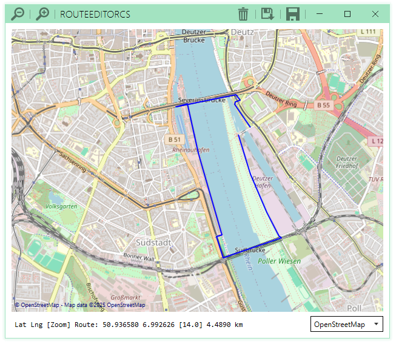

# RouteEditor C#

RouteEditor C# is a simple but modern Windows Application in C# and WPF to get to draw and measure routes
in kilometers, save and load them.

A GTK4 version of RouteEditor exists here: [gitlab.com/deadlockz/routeeditor](https://gitlab.com/deadlockz/routeeditor)

Because Offline Maps does not work well, I remove it from *OffRouteMap* and call
the Application *RouteEditor C#* now.

## UI Features

- map
  - [x] select different maps
  - [x] move area via left click
  - [x] in/out zoom via mouse wheel
  - [x] display position of cursor in status line
- route
  - [x] display on map in all zoom states
  - [x] start, end and set a point via double click
  - [x] remove route from map (click on trash icon)
  - [x] remove last route point via right click
  - [x] display distance in status line
- settings
  - [x] GUI size
  - [x] initial/last position
  - [x] initial/last zoom
- menu (or similar)
  - [x] load route (file window)
  - [x] save route (file window)
  - [x] set tiles folder ("file" window, suitcase icon)

## Dev Docs

See [here](https://no-go.github.io/RouteEditorCS/api/OffRouteMap.html)!

## Future tasks

- [x] ci/cd
  - [x] some unit tests via xUnit
    - [x] mock example
    - [x] code coverage report
  - [x] build a release executeable
  - [x] in code documentation and something similar to doxygen/breath
